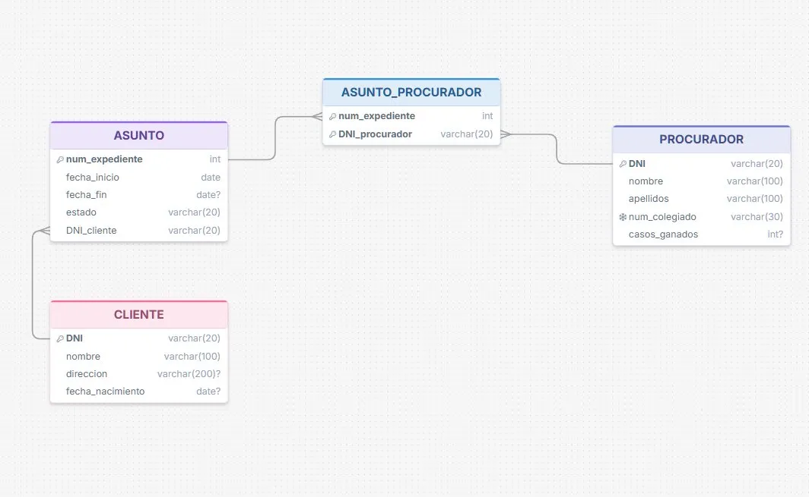

# Modelo Lógico Relacional

## Diagrama de tablas

## Descripción de tablas

### CLIENTE
| Campo | Tipo | Clave |
|-------|------|-------|
| DNI | VARCHAR(20) | PK |
| nombre | VARCHAR(100) | |
| direccion | VARCHAR(200) | |
| fecha_nacimiento | DATE | |

### ASUNTO
| Campo | Tipo | Clave |
|-------|------|-------|
| num_expediente | INT | PK |
| fecha_inicio | DATE | |
| fecha_fin | DATE | |
| estado | VARCHAR(20) | |
| DNI_cliente | VARCHAR(20) | FK → CLIENTE |

### PROCURADOR
| Campo | Tipo | Clave |
|-------|------|-------|
| DNI | VARCHAR(20) | PK |
| nombre | VARCHAR(100) | |
| apellidos | VARCHAR(100) | |
| num_colegiado | VARCHAR(30) | |
| casos_ganados | INT | |

### ASUNTO_PROCURADOR
| Campo | Tipo | Clave |
|-------|------|-------|
| num_expediente | INT | PK + FK → ASUNTO |
| DNI_procurador | VARCHAR(20) | PK + FK → PROCURADOR |